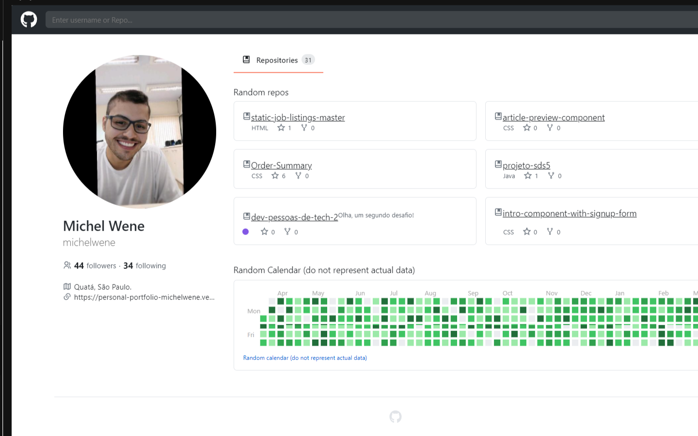

# Frontend Mentor - Advice Generator

Esta é uma solução para o [Github Clone](http://github.com). o objetivo foi criar um clone do app do github.

## :dart: Resumo de conteúdos

- [Visão Geral](#Visão-Geral)
  - [O desafio](#O-desafio)
  - [Captura de tela](#Captura-de-tela)
  - [Links](#Links)
- [Meu processo](#Meu-processo)
  - [Construído com](#Constrído-com)
  - [O que eu aprendi](#O-que-eu-aprendi)
  - [Continuação dos desenvolvimentos](#Continuação-dos-desenvolvimentos)
  - [Recursos utilizados](#Recursos-utilizados)
- [Autor](#Autor)

## Visão Geral.

### :globe_with_meridians: O desafio

Os usuários devem ser capazes de:

- Visualizar o layout ideal para o aplicativo, dependendo do tamanho da tela do dispositivo.
- Visualizar os estados de foco para todos os elementos interativos na página.
- Visualizar repositórios do Github.

### Captura de tela

- Desktop
<p  align="center" >
  
</p>

- Tablet
<p  align="center" >

</p>

- Mobile
<p  align="center" >

</p>

- Gif
<p  align="center" >

</p>

### Links

- Solução URL: [https://github.com/michelwene/Advice-Generatorp](https://github.com/michelwene/Advice-Generator)
- Site URL: [https://advice-generator-9qntgsq9w-michelwene.vercel.app/](https://advice-generator-9qntgsq9w-michelwene.vercel.app/)

## :page_with_curl: Meu processo

### Construído com

- ReactJS
- Typescript
- Axios
- Styled-Components
- Design responsivo
- React-Icons
- react-calendar-heatmap

### :bulb: O que eu aprendi

```typescript
export function App() {
  const [themeName, seThemeName] = useState<ThemeName>("light"); // tema padrão selecionado inicia com o light.
  const currentTheme = themes[themeName];

  return (
    <ThemeProvider theme={currentTheme}>
      <BrowserRouter>
        <Header themeName={themeName} setThemeName={seThemeName} />
        <Routes>
          <Route path="/" element={<Profile />} />
          <Route path="/:username" element={<Profile />} />
          <Route path="/:username/:reponame" element={<Repo />} />
        </Routes>

        <GlobalStyles />
        <Footer />
      </BrowserRouter>
    </ThemeProvider>
  );
}
//Está função é o 'APP', neste component eu adiciono o component Header, crio rotas para as diferentes páginas, adiciono o GlobalStyles, e o component Footer, e também adiciono o ThemeProvider, que ser para a troca de tema entre dark e light.

const Profile: React.FC = () => {
  const { username = "michelwene" } = useParams(); // Utilizei UseParams para recolher o username na url.
  const [data, SetData] = useState<Data>();

  useEffect(() => {
    Promise.all([
      fetch(`https://api.github.com/users/${username}`), // conectando com a API e com o repositório de acordo com o username.
      fetch(`https://api.github.com/users/${username}/repos`), // conectando com a API e com o repositório para repos.
    ]).then(async (response) => {
      const [userResponse, reposResponse] = response;

      const user = await userResponse.json(); // conectando a API e pegando apenas a requisição de username.
      const repos = await reposResponse.json(); // conectando a API e pegando apenas a requisição de repositório.

      const shuffledRepos = repos.sort(() => 0.5 - Math.random()); // uma lógica aplicada para selecionar diferentes quadrados.
      const slicedRepos = shuffledRepos.slice(0, 6);

      SetData({
        user,
        repos: slicedRepos,
      });
    });
  }, [username]);

  if (data?.error) {
    return <h1>{data.error}</h1>;
  }

  if (!data?.user || !data?.repos) {
    return <h1>Loading...</h1>;
  }

  const TabContent = () => (
    <div className="content">
      <RepoIcon />
      <span className="label">Repositories</span>
      <span className="number">{data.user?.public_repos}</span>
    </div>
  );

  return (
    <Container>
      <Tab className="desktop">
        <div className="wrapper">
          <span className="offset"></span>
          <TabContent />
        </div>

        <span className="line"></span>
      </Tab>
      <Main>
        <LeftSide> // Parte esquerda do Github.
          <ProfileData
            username={data.user.login}
            name={data.user.name}
            avatarUrl={data.user.avatar_url}
            followers={data.user.followers}
            following={data.user.following}
            company={data.user.company}
            location={data.user.location}
            email={data.user.email}
            blog={data.user.blog}
          />
        </LeftSide>
        <RightSide> //// Parte direita do Github.
          <Tab className="mobile">
            <TabContent />
            <span className="line" />
          </Tab>

          <Repos>
            <h2>Random repos</h2>
            <div>
              {data.repos.map((item) => (
                <RepoCard
                  key={item.name}
                  username={item.owner.login}
                  reponame={item.name}
                  description={item.description}
                  language={item.language}
                  stars={item.stargazers_count}
                  forks={item.forks}
                />
              ))}
            </div>
          </Repos>

          <CalendarHeading>
            Random Calendar (do not represent actual data)
          </CalendarHeading>

          <RandomCalendar /> // Calendário sortido do github.
        </RightSide>
      </Main>
    </Container>
  );
};

//
```

### Continuação dos desenvolvimentos

Pretendo continuar fazendo projetos para melhorar meus conhecimentos em ReactJS e TypeScript, posteriormente, utilizar NextJS.

### Recursos utilizados

- [Developer Mozilla](https://developer.mozilla.org/en-US/docs/Web/JavaScript) - A documentação do Developer Mozilla é essencial para compreender as funções e conseguir aplicar as mesmas no projeto.


## :medal_military: Autor

- Linkedin - [@michelwene](https://www.linkedin.com/in/michelwene/)
